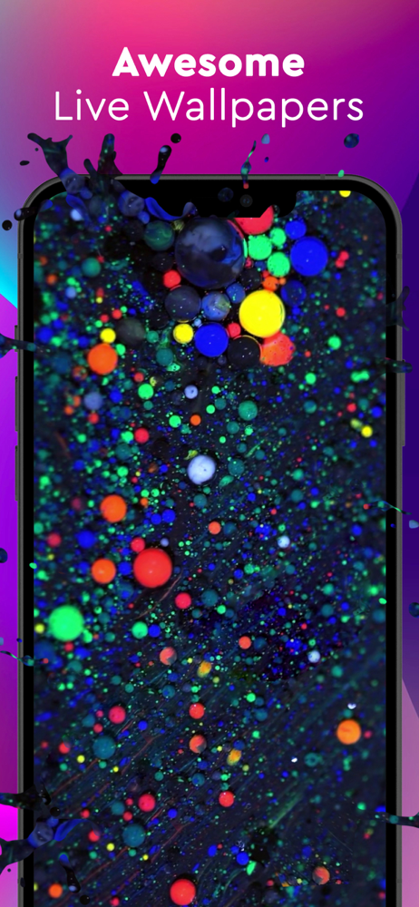

# Portfolio
This is my portfolio for my whole iOS Engineer experiences

##  Wallpix
  
Wallpix is a wallpaper, ringtone, color screen, live wallpaper, widgets app.
* _**What I've learnt**_
  * Working with REST API to gather application resources and contents.
  * Reactive Programming with [RxSwift](https://github.com/ReactiveX/RxSwift)
  * Used URLSession with RxSwift wrappers
  * Working with OneSignal
  * iOS Application Life Cycle (Coding to Launch)
  * Access users files to crop a ringtone using [SwiftyDropbox](https://github.com/dropbox/SwiftyDropbox) and GoogleDrive api
  * Data Persistance with [Realm](https://developer.apple.com/library/ios///documentation/Cocoa/Conceptual/CoreData/index.html)
  * Followed MVP architecture.
  * SiriKit and Intents API
  * SwiftUI used for whole Widget module.
  * Created an audio cropper module.

  
  
  
  
  
  
  
  

##  Cartoon TV

Cartoon TV is a live streaming application that uses HLS(HTTP Live Streaming). Includes cartoon content for kids.

* _**What I've learnt**_
  * Worked highly with AVFoundation
  * Implemented a custom Video Player
  * Data Persistance with [Realm Database](https://github.com/realm/realm-cocoa)
  * Revenuecat SDK
  * [Facebook SDK](https://developers.facebook.com/docs/ios/)
  * HLS(HTTP Live Streaming)

  
  
  
  

##  Car Tuning Studio

Car Tuning Studio is an image overlap application, that user can modify original car parts with real car image brands

* _**What I've learnt**_
  * Created an image overlapping module from this app.
  * Server-less Architecture and Socials Authentication using [Firebase](https://firebase.google.com)
  * Realtime Messaging using [Firebase Notifications](https://firebase.google.com/docs/notifications/)
  * WidgetKit
  
  
  
  
  
  

##  Hydra: Water Reminder

Hydra is a side project, it is a water reminder application, that user can customize 

* _**What I've learnt**_  
  * Networking Layer using [AFNetworking](https://github.com/AFNetworking/AFNetworking)
  * SwiftUI with WidgetKit
  * Manage Code by applying [MVVM Architecture](https://www.objc.io/issues/13-architecture/mvvm/)
  * Followed Coordinator Pattern using [XCoordinator](https://github.com/quickbirdstudios/XCoordinator)
  * Light theme - Dark theme
  * SiriKit

  
  
  
  

##  Calmly: Baby Sleep Sounds

Calmly is a relaxing sound application

* _**What I've learnt**_

  * Reactive Programming with RxSwift 
  * Side Menu (Hamburger) using [MMDrawerViewController](https://github.com/mutualmobile/MMDrawerController)
  * Created a sound mixer using AVFoundation
  * Worked with Date and Time and Timers.

  
  
  
  
  
  

##  Enlive
  Enlive is a photo to live wallpaper converter application.

* _**What I've learnt**_
  
  * Custom UI Transitions
  * [PhotoKit](https://developer.apple.com/documentation/photokit)
  * AppClip
  

  
  
  
  
  

## Module: Permatic
Permatic is a sequentially permission opener module to be used with ATT framework.

* _**What I've learnt while making it**_
  * A/B Testing with Firebase
  * Firebase Remote config

## Module: Purchase Handling

Purchase handling module actually handles purchases, also it is easy to extent with just implementing protocols

* _**What I've learnt**_
  * RevenueCat SDK

## Module: PWA App Shortcut Maker

It is a PWA maker with HTML. opens with safari and allows user to create easily shortcut to another application.

* _**What I've learnt while making it**_
  * Deep Linking (Go to App directly from generated specific URL Scheme)
